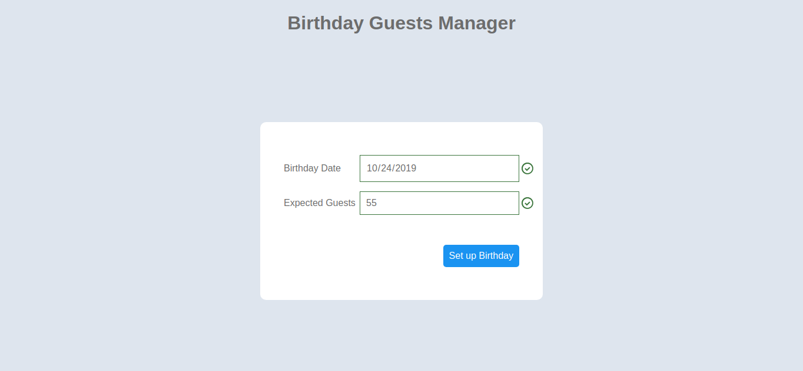
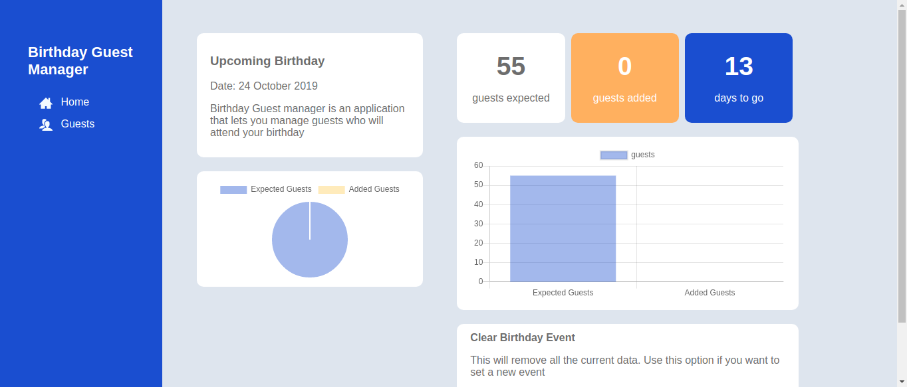
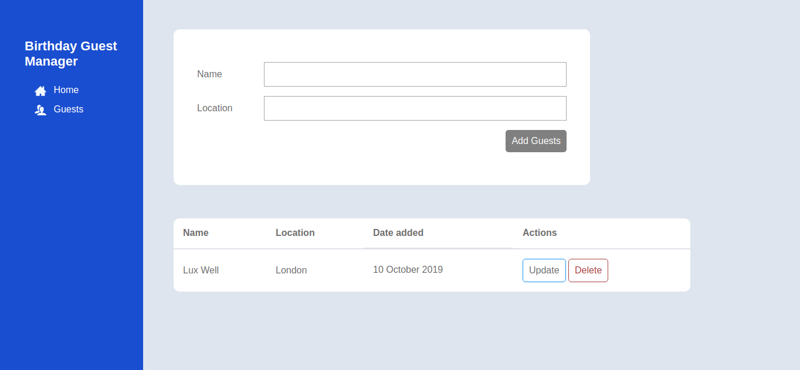

# Birthday Guests Manager

This app intended to be used to manage the guests you are expecting to attend a birthday event. You can add/remove guests, you can also see how many guests you have against your expected guests target.

This project was mostly done for practicing CRUD with plain Javascript and playing around with Chart.js to create visualizations.

## Demo

Here is a link to the live demostration: [https://stanulilic.github.io/birthday-guest-manager/](https://stanulilic.github.io/birthday-guest-manager/)

## Stack
I used the following to do the project:
- Html and Css
- Plain Javascript
- Chart.js for visualization

## 1. Setup Birthday Event
A user creates an event by entering date and the number of guests expected.

## 2. Homepage
A user can see how many guests have been added on the columns and also the charts, including remaining days to the birthday event.

## 3. Add guests
The section allows a user to add the guests he/she is expecting. The user can also delete or update the guests details

